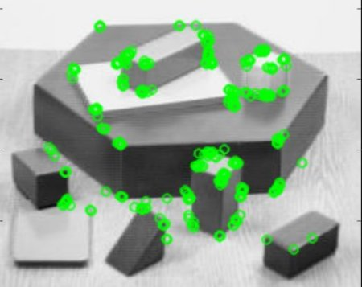

# Sample Applications

<a href="https://www.khronos.org/openvx/" target="_blank">Khronos OpenVX™</a> is an open, royalty-free standard for cross-platform acceleration of computer vision applications. OpenVX enables performance and power-optimized computer vision processing, especially important in embedded and real-time use cases such as face, body, and gesture tracking, smart video surveillance, advanced driver assistance systems (ADAS), object and scene reconstruction, augmented reality, visual inspection, robotics and more.

In this project, we provide samples that use our optimized libraries to build applications that showcase potential usage or may used as reference to develop your own products.

## Bubble Pop

In this sample we will create an OpenVX graph to run Bubble Pop on a live camera. This sample application uses <a href="https://en.wikipedia.org/wiki/OpenCV" target="_blank">OpenCV</a> to decode input image, draw bubbles/donuts and display the output.

 

## Canny Edge Detector

In this sample we will create an OpenVX graph to run canny edge detection on an image or a live camera. This sample application uses <a href="https://en.wikipedia.org/wiki/OpenCV" target="_blank">OpenCV</a> to decode input image and display the output.

 

## Optical Flow

This sample [application](./optical_flow/README.md#openvx-samples) we will create an OpenVX graph to run Optical Flow on a video/live. This sample application uses <a href="https://en.wikipedia.org/wiki/OpenCV" target="_blank">OpenCV</a> to decode input video and display the output.

 
  

## Skin Tone Detector

In this sample we will create an OpenVX graph to run skintone detection on an image or a live camera. This sample application uses <a href="https://en.wikipedia.org/wiki/OpenCV" target="_blank">OpenCV</a> to decode input image and display the output.

 

## ORB (Oriented FAST and Rotated BRIEF)
In this sample we will create an OpenVX graph to run ORB (Oriented FAST and Rotated BRIEF) on a live camera. This sample application uses <a href="https://en.wikipedia.org/wiki/OpenCV" target="_blank">OpenCV</a> to detect and display keypoints.

 

