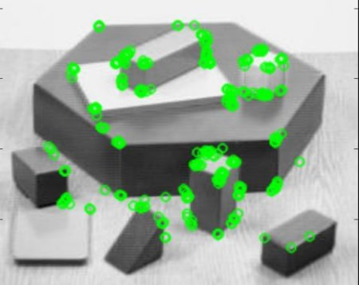

 ## ORB Sample

In this sample we will create an OpenVX graph to run ORB (Oriented FAST and Rotated BRIEF) on a live camera. This sample application uses <a href="https://en.wikipedia.org/wiki/OpenCV" target="_blank">OpenCV</a> to detect and display keypoints.

  <p align="center"></p>

### Prerequisites

* [Conformant OpenVX Implementation](https://github.com/KhronosGroup/Khronosdotorg/blob/master/api/openvx/resources.md)

* [OpenCV](https://github.com/opencv/opencv/releases/tag/3.4.0)

### Steps to run the skin tone sample

* **Step - 1:** Build and install [Conformant OpenVX Implementation](https://github.com/KhronosGroup/OpenVX-sample-impl). In this example we will use the OpenVX Sample Implementation available on [GitHub](https://github.com/KhronosGroup/OpenVX-sample-impl)

```
Build OpenVX on Linux

* Git Clone project with a recursive flag to get submodules

      git clone --recursive https://github.com/KhronosGroup/OpenVX-sample-impl.git

* Use Build.py script

      cd OpenVX-sample-impl/
      python Build.py --os=Linux --arch=64 --conf=Debug --conf_vision --enh_vision --conf_nn
```

* **Step - 2:** Export OpenVX Directory Path

```
export OPENVX_DIR=$(pwd)/install/Linux/x64/Debug
```

* **Step - 3:** Clone the OpenVX Samples project and build the Skin Tone application

```
cd ~/ && mkdir OpenVXSample-skintone
cd OpenVXSample-skintone/
git clone https://github.com/kiritigowda/openvx-samples.git
```

* **Step - 4:** CMake and Build the Skin Tone application

```
mkdir skintone-build && cd skintone-build
cmake -DOPENVX_INCLUDES=$OPENVX_DIR/include -DOPENVX_LIBRARIES=$OPENVX_DIR/bin/libopenvx.so ../openvx-samples/skin-tone-detector/
make
```

* **Step - 5:** Run Skin Tone Detector application

    * **Live**

    ```
    ./skinToneDetector --live
    ```

    * **Image**

    ````
    ./skinToneDetector --image ../openvx-samples/images/face.png
    ````
